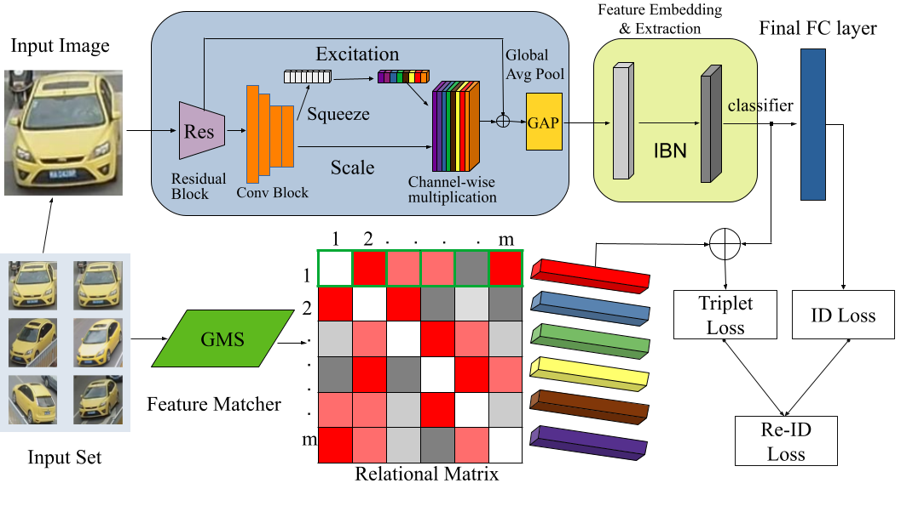

<div align='center'>
<h2 align="center"> Relation Preserving Triplet Mining for Stabilising the Triplet Loss in Re-identification Sytems </h2>
<h3 align="center">WACV 2023</h3>

<a href="https://adhirajghosh.github.io/">Adhiraj Ghosh</a><sup>1,2</sup>, <a href="https://kuruparan.github.io/">Kuruparan Shanmugalingam</a><sup>1,3</sup>, <a href="https://www.kind-of-works.com/">Wen-Yan Lin</a><sup>1</sup>

<sup>1</sup>Singapore Management University <sup>2</sup>University of Tübingen <sup>3</sup>University of New South Wales

[](https://paperswithcode.com/sota/vehicle-re-identification-on-veri-776?p=relation-preserving-triplet-mining-for)
[](https://paperswithcode.com/sota/vehicle-re-identification-on-vehicleid-small?p=relation-preserving-triplet-mining-for)

<a href="https://pytorch.org/get-started/locally/"></a>

[[Paper](https://openaccess.thecvf.com/content/WACV2023/html/Ghosh_Relation_Preserving_Triplet_Mining_for_Stabilising_the_Triplet_Loss_In_WACV_2023_paper.html)]
[[Video](https://youtu.be/TseV_Hoz2Ms?si=VlAReJ2eETPmYKh1)]

The *official* repository for **Relation Preserving Triplet Mining for Stabilising the Triplet Loss in Re-identification Sytems**. Our work achieves state-of-the-art results and provides a faster optimised and more generalisable model for re-identification.
</div>

## Network Architecture


## Preparation

### Installation

1. Install CUDA compatible torch. Modify based on CUDA version.
```
conda install pytorch torchvision torchaudio pytorch-cuda=11.6 -c pytorch -c nvidia
```
2. Install other dependencies.
```bash
pip install -r requirements.txt
```

3. Install apex (optional but recommended)

Follow the installation guidelines from https://github.com/NVIDIA/apex
Then set SOLVER.USE_AMP as True in the config files directly or via command line.
### Prepare Datasets

```bash
mkdir data
```

Download the vehicle reID datasets [VehicleID](https://www.pkuml.org/resources/pku-vehicleid.html) and [VeRi-776](https://github.com/JDAI-CV/VeRidataset), and the person reID datasets [DukeMTMC-reID](https://arxiv.org/abs/1609.01775).
Follow the structure and naming convention as below.

```
data
├── duke
│   └── images ..
├── vehicleid
│   └── images ..
└── veri
    └── images ..
```

### Prepare GMS Feature Matches
```bash
mkdir gms
```

You need to download the GMS feature matches for VeRi, VehicleID and DukeMTMC: [GMS](https://drive.google.com/drive/folders/1hdk3pi4Bi_Tb2B7XcBmvwG91Sfisi6BO?usp=share_link).

The folder should follow the structure as shown below:
```
gms
├── duke
│   └── 0001.pkl ..
├── vehicleid
│   └── 00001.pkl ..
└── veri
    └── 001.pkl ..
```
## Running RPTM
1. Training
```bash
python main.py --config_file configs/veri_r101.yml 
```
The above command trains a baseline using our RPTM algorithm for VeRi. Note that after training, the model provides evaluation results, both qualitative as well as quantitative.

2. RPTM Thresholding Strategies

In Section 4.2 of our paper, we defined a thresholding strategy for better anchor-positive selections. We define this in config files as MODEL.RPTM_SELECT. While it is set to 'mean', feel free to work with 'min' and 'max'.

#### Min Thresholding
```bash
python main.py --config_file configs/veri_r101.yml MODEL.RPTM_SELECT 'min'
```

#### Max Thresholding
```bash
python main.py --config_file configs/veri_r101.yml MODEL.RPTM_SELECT 'max'
```

3. Testing
```bash
mkdir logs
python main.py --config_file configs/veri_r101.yml TEST.WEIGHT '<path to trained model>' TEST.EVAL True 
```

## Mean Average Precision(mAP) Results
1. VeRi776: **88.0%**
2. VehicleID (query size 800): **84.8%**
3. VehicleID (query size 1600): **81.2%**
4. VehicleID (query size 2400): **80.5%**
5. DukeMTMC: **89.2%**

## Acknowledgement

GMS Feature Matching Algorithm taken from: https://github.com/JiawangBian/GMS-Feature-Matcher

## Citation

If you find this code useful for your research, please cite our paper

```
@InProceedings{Ghosh_2023_WACV,
    author    = {Ghosh, Adhiraj and Shanmugalingam, Kuruparan and Lin, Wen-Yan},
    title     = {Relation Preserving Triplet Mining for Stabilising the Triplet Loss In re-Identification Systems},
    booktitle = {Proceedings of the IEEE/CVF Winter Conference on Applications of Computer Vision (WACV)},
    month     = {January},
    year      = {2023},
    pages     = {4840-4849}
}
```

## Contact

If you have any questions, please feel free to contact us. E-mail: [Adhiraj Ghosh](mailto:adhirajghosh1998@gmail.com) , [Wen-Yan Lin](mailto:daniellin@smu.edu.sg)
